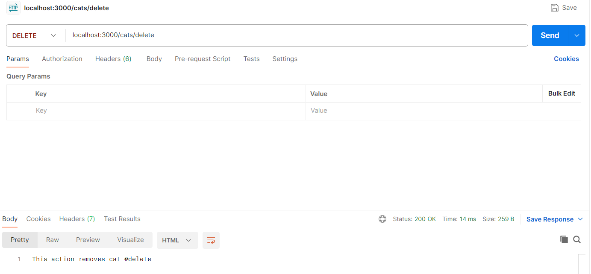
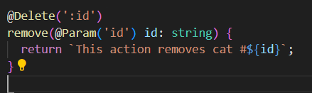

# Metodo "delete".
Utilizamos los primeros decoradores en NestJs. Primero creamos nuestro controlador 'cats' y dentro de este creamos nuestro dto para crear nuestra clase(entidad).

Creada nuestra entidad empezamos importando en el archivo "cats.controller.ts" donde empezaremos a crear la logica de nuestros controladores 

El método remove del controlador de gatos (CatsController) elimina un gato por su ID, que se pasa como parámetro en la URL. La documentación del método incluye una descripción del propósito del método y el significado del parámetro id, así como un comentario @param que indica qué representa el parámetro id y qué tipo de valor se espera que sea (string).

[Video Youtube](https://youtu.be/7YbLZWtl8NY)